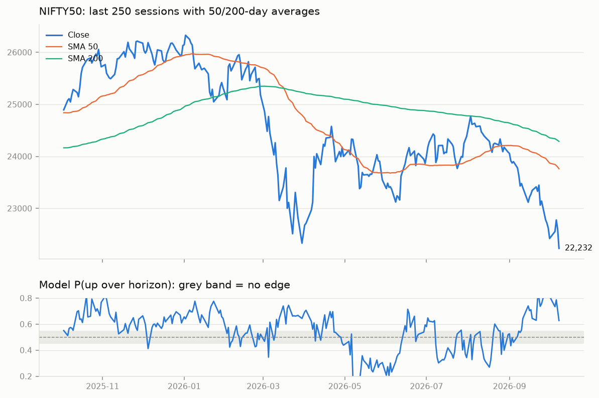
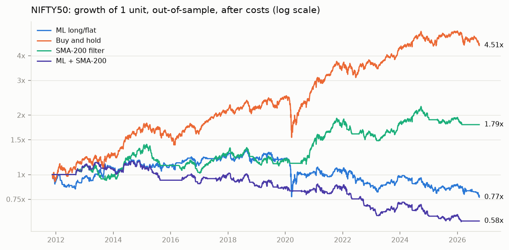
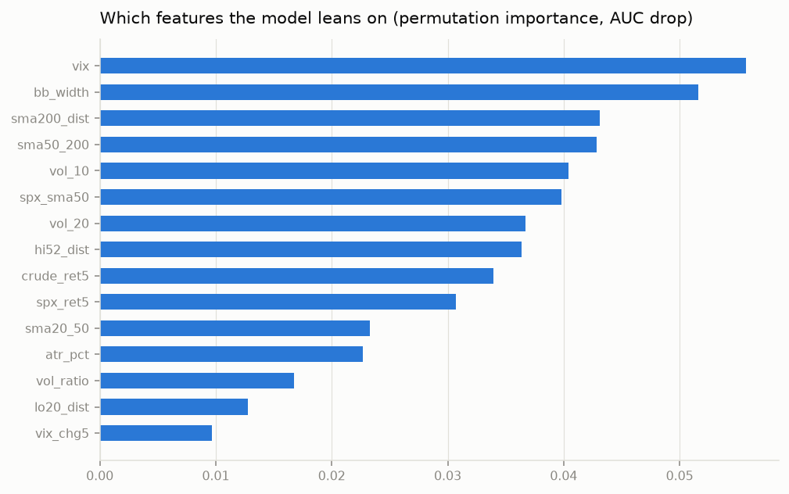

## NIFTY50 daily read: 2026-10-08

Close **22,231.80** (2026-10-08). Model P(up over next 5 sessions) = **0.593**: mild bullish lean.

## How much to trust it

Walk-forward out-of-sample: accuracy 0.525, balanced 0.499, AUC 0.505, always-up baseline 0.567 over 3650 predictions. **No proven edge** (AUC ~0.5): treat the probability as noise. Close is below the 200-day SMA.

| strategy | CAGR | max DD | Sharpe | switches |
|---|---|---|---|---|
| ml | -1.8% | -42.0% | -0.06 | 543 |
| sma200 | +4.0% | -28.6% | 0.42 | 122 |
| combo | -3.6% | -50.6% | -0.37 | 454 |
| buy_and_hold | +10.6% | -38.4% | 0.72 | 1 |

Costs 20.0 bps per switch; ml enters above 0.55, exits below 0.50.

## NIFTY 50 swing scan: strongest

| symbol     |   close |   score |   rsi14 |   ret_1m |   rel_3m |   from_20d_high |   atr_pct |
|:-----------|--------:|--------:|--------:|---------:|---------:|----------------:|----------:|
| KOTAKBANK  |  435    |     4.7 |      65 |      5.1 |     20.5 |            -1.5 |       2.1 |
| TRENT      | 2876.3  |     4.2 |      60 |      2   |      6.4 |            -2   |       2.4 |
| ICICIBANK  | 1349    |     3.3 |      49 |     -2.9 |      3.7 |            -2.9 |       1.6 |
| AXISBANK   | 1245    |     3.1 |      53 |      0.5 |      1.6 |            -1.1 |       1.9 |
| ETERNAL    |  319.05 |     2.5 |      46 |     -0.5 |     19.1 |            -7.4 |       2.6 |
| BHARTIARTL | 1804.6  |     2.5 |      47 |     -0.6 |      3.3 |            -4.7 |       1.8 |
| ADANIPORTS | 1708    |     2.1 |      44 |     -3.8 |      1.6 |            -6.4 |       2.5 |
| HDFCLIFE   |  544.5  |     1.6 |      53 |      5.9 |      2.2 |            -4   |       2.5 |
| INDIGO     | 4813.1  |     1.5 |      41 |     -3.3 |     -0.7 |            -5.1 |       2.3 |
| ADANIENT   | 2596    |     1.5 |      30 |    -16.4 |    -11.1 |           -15.8 |       3.4 |

## NIFTY 50 swing scan: weakest

| symbol     |   close |   score |   rsi14 |   ret_1m |   rel_3m |
|:-----------|--------:|--------:|--------:|---------:|---------:|
| JIOFIN     |  211    |       0 |      29 |     -8.7 |     -5.2 |
| MAXHEALTH  |  873.4  |       0 |      23 |    -15.8 |    -13.8 |
| POWERGRID  |  244.65 |       0 |      28 |     -8   |     -6.8 |
| TATACONSUM |  951.9  |       0 |      36 |     -4.9 |     -6.1 |
| TMPV       |  273    |       0 |      29 |     -9.9 |    -13   |

## Disclaimer

Educational tool. Out-of-sample accuracy on daily direction is typically 52-56%. A probability is a lean, not a forecast. Risk only what the position-size rule allows.
